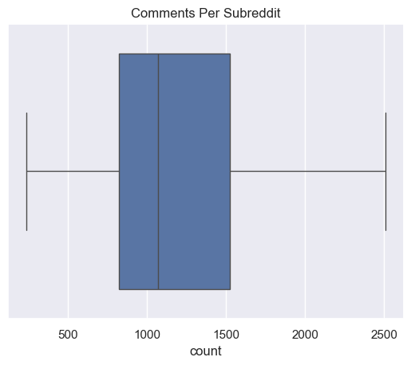
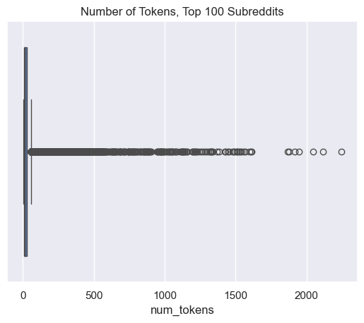
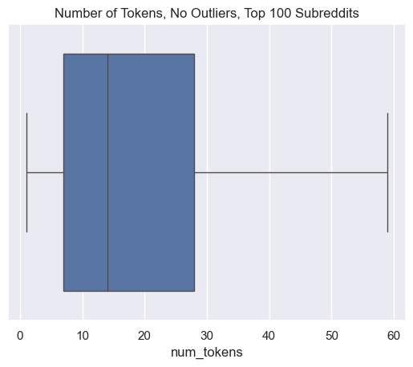
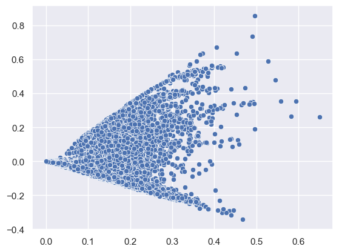
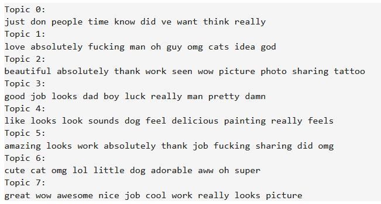
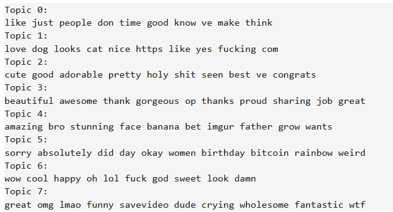
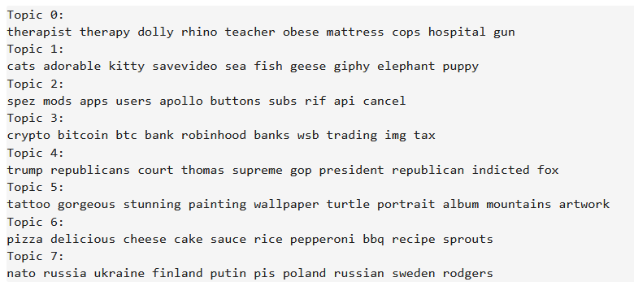
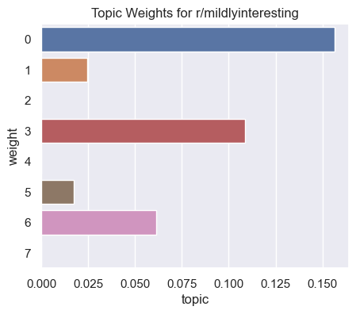
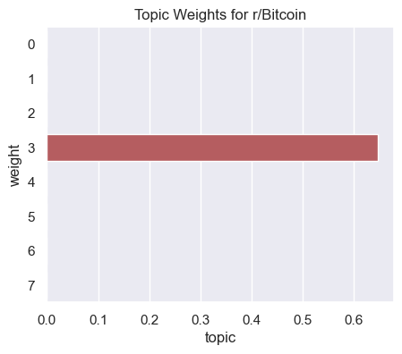

# Subreddit Clustering
by Madeline Powers

## Introduction
Reddit is a fascinating source of linguistic data. It provides a vast number of posts and comments, all already organized into subreddits by topic. This project aims to further examine this topic grouping, by trying to further group subreddits by topic, and analyze their content by using topic modeling techniques.

## Data Collection
Instead of using a preexisting dataset, I decided to collect my own. To start, I needed a list of subreddits to scrape from. The most comprehensive list I could find online was reddit's own [Top Communities](https://www.reddit.com/best/communities/1/) page. Strangly, this list doesn't include every subreddit, r/AmItheAsshole for example is excluded. Unfortunately I couldn't find a better list with this many subreddits, so it's what I used. [`scrape_top_comments.py`](https://github.com/Data-Science-for-Linguists-2024/subreddit-clustering/blob/main/scripts/scrape_top_subreddits.py) scrapes this list using beautifulsoup and writes it to a file. This was the list I used for my next step.

The next step was scraping text from reddit. I decided to specifically use comments, as some subreddits only allow image posts, but (nearly) every subreddit allows comments. This removes any bias that might come from not including image based subreddits. To scrape the comments, I used [PRAW](https://praw.readthedocs.io/en/stable/), a python wrapper for the reddit API. [`scrape_comments.py`](https://github.com/Data-Science-for-Linguists-2024/subreddit-clustering/blob/main/scripts/scrape_comments.py) uses PRAW and the list of subreddits to get all comments for the top 10 most upvoted posts of the past year. This script took a very long time to run due to reddit's rate limits, which were recently reduced. I had to leave my computer on overnight twice, but ended up with a very good dataset.

Another big problem with this dataset was sharing it. To my knowledge, reddit doesn't like people publishing large amounts of text obtained using their API. To get around this, I took inspiration from the [GUM corpus](https://github.com/amir-zeldes/gum). My published data is the same as the full dataset, but with the `text` field removed using [`redact_data.py`](https://github.com/Data-Science-for-Linguists-2024/subreddit-clustering/blob/main/scripts/redact_data.py). Using the `comment_id` field and the reddit api, the text can be retrieved to reconstruct the whole dataset, minus any comments that may have been deleted since I collected it myself, using [`unredact_data.py`](https://github.com/Data-Science-for-Linguists-2024/subreddit-clustering/blob/main/scripts/unredact_data.py).

## Data cleanup and exploration
The dataset as output by my script was already quite clean, containing only the fields I expected to need for my analysis. I cleaned and explored it in my [data exploration](https://nbviewer.org/github/Data-Science-for-Linguists-2024/subreddit-clustering/blob/main/notebooks/data_exploration.ipynb) notebook. The main thing to clean out were deleted and removed comments, which can be easily identified as they just contain the text `[deleted]`, or `[removed]`. This resulted in a distribution of number of comments per subreddit like this:

Most of the subreddits have around 1000 comments, with only a pretty small number having less than 500. After this cleaning, I processed the data more, adding measures such as number of tokens, number of types, TTR, and average word length. The token count is another good measure for getting a sense of the scale of the data:

There are a lot of outliers in this graph, but it's clear that most comments are extremely short with only outliers being longer, if we remove the outliers, the actual size of most comments becomes visible:

The average token count is around 15, so most comments are extremely short. With the data processed, I moved on to analysis.

## Analysis
All analysis of my daat was done in my [clustering](https://nbviewer.org/github/Data-Science-for-Linguists-2024/subreddit-clustering/blob/main/notebooks/clustering.ipynb) notebook. To start, I tried clustering the individual comments. The SVD decompisition of the vectorized comments looked like this:

There weren't any obvious clusters here, but I gave it a shot anyways and tried clustering, here are the topics produced by Non-negative Matrix Factorization (NMF) and Latent Dirichlet Allocation (LDA) in that order.

These weren't really what I was trying to get at all, I tried poking around with them a bit more but nothing interesting came of it. I had to change my approach. Since the comments are all really short, they don't work very well with document clustering algorithms. Because of this, I decided to try grouping all comments from each subreddit into a single document for each subreddit, to give the algorithms more to work with, and this worked! Here are the topics produced by NMF after rearranging the data like this:

These topics are a lot more recognizable as topics! A few of them are a bit strange, like topic 0 doesn't make much sense, but the rest do! Topic 1 is pets, topic 2 is people complaining about reddit's administration decisions, topic 3 is cryptocurrency, and so on. After looking at the top subreddits in each topic and being a little confused by r/mildlyinteresting being in the bitcoin topic, I decided to look at the topic weights per subreddit.

These graphs explained my confusion, the weight of the cryptocurrency topic on r/mildlyinteresting was lower than that of topic 0, but it was still high enough to be in the top 5 subreddits in that topic.

Unfortunately, I ran out of time before I could get much analysis done on the contents of each topic, and didn't find anything interesting within the analysis I did do, but this leaves room for future expansion of the project.

## Difficulties
My main difficulty working on this project was time management. I'm not used to long term projects like this, so it was tricky to figure out how to balance it with the rest of my work. It has been a great learning experience on that front though. Because of these time management issues, I ended up running out of time before getting much analysis done. I also had some trouble figuring out exactly what to analyze within the clusters that I never fully resolved. Finally, the reddit API rate limits made it a lot harder to make any changes to my data set, as almost any minor change to format would have resulted in having to leave my computer running a script for upwards of 8 hours. This limited the analysis I could do as my initial dataset didn't include things like upvote count or number of replies.

## Conclusion
This project has been a great learning experience. While I didn't quite finish what I wanted to do, there are a lot of good directions I could take the project if I chose to continue it. My dataset is quite large and I'm sure there are many more interesting insights that can be pulled from it. If I were to continue, the main thing I would want to focus on is more specific analysis of the contents of the clusters that I found, this is definitely the part where the project falls short in its current state.
